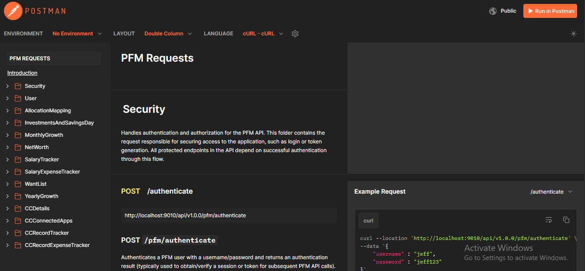

# Personal Finance Manager – REST API

This repository contains the **Spring Boot REST API** for the Personal Finance Manager project.  
It provides backend services and endpoints to manage financial data, serving as the bridge between the database and other modules in the ecosystem.

⚠️ **Note:** This is a **work in progress** and part of the larger Personal Finance Manager system.

## Overview

The REST API is designed to:

- 🔗 Expose endpoints for managing income, expenses, budgets, and savings
- ⚙️ Support CRUD operations for financial records
- 📡 Integrate with the frontend dashboard and analytics tools
- 🔒 Ensure secure and consistent data handling

## API Endpoints

Refer to the Postman collection published below:
Collection: [Link](https://documenter.getpostman.com/view/30170318/2sBXiomAEZ)

